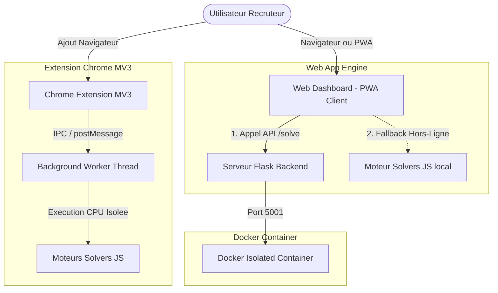
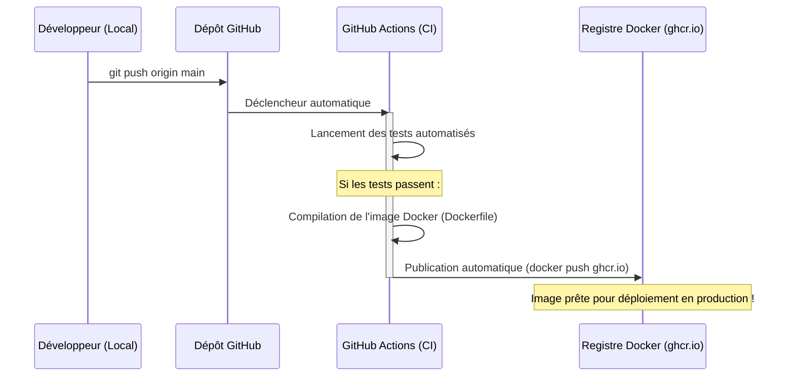

# 🧠 Min-Conflict - Solisseur Interactif de CSP (Constraint Satisfaction Problems)

[](https://github.com/rfluciano/Min-Conflit-Interactive-CSP-Solver)
[](LICENSE)
[](#)

Bienvenue dans le **Min-Conflict CSP Solver**, une suite applicative complète et premium dédiée à la résolution et à la visualisation interactive de Problèmes de Satisfaction de Contraintes (CSP) — spécifiquement le problème des **N-Reines (N-Queens)** et du **Sudoku**.

Ce projet a été conçu avec un soin tout particulier accordé à l'architecture logicielle, à l'expérience utilisateur (UX) et aux performances, afin d'offrir une démonstration technique de niveau portfolio pour les recruteurs.

---

## 🚀 Fonctionnalités Clés

*   **Solveur Multi-Moteurs Synchrone** : Résolution du Sudoku en temps réel via l'algorithme systématique de **Backtracking avec heuristique MRV** ou l'approche stochastique par recherche locale **Min-Conflicts**.
*   **Visualisation Cyberpunk Interactive** : Interface responsive haut de gamme bâtie sur un thème sombre HSL (Deep Dark space), intégrant un système de contrôle de timeline fluide (lecture, pause, vitesse, étape par étape) et des effets de particules via `particles.js`.
*   **Architecture Offline-First (PWA)** : Support d'installation native sous Windows 10+ via une **Progressive Web App (PWA)** dotée d'un Service Worker (`sw.js`) pour la mise en cache.
*   **Bascule Transparente Hors-Ligne (Failover)** : Si le serveur Flask s'arrête, l'application web bascule instantanément sur un moteur de résolution Javascript client (`solvers.js`) totalement autonome, conservant toutes les visualisations et statistiques de résolution !
*   **Extension de Navigateur Chrome/Edge MV3** : Extension de navigateur moderne (Manifest V3) utilisant une architecture multithread avec un Web Worker en arrière-plan pour exécuter les calculs sans bloquer l'interface utilisateur.
*   **Orchestration Docker** : Conteneurisation isolée et reproductible avec Dockerfile et Docker Compose.
*   **Intégration CI/CD** : GitHub Actions pour automatiser les tests et le déploiement.

---

## 📐 Architecture du Système

Le projet s'articule autour de trois environnements interconnectés et redondants :



---

## 🧠 Analyse Algorithmique : Min-Conflicts vs Backtracking

Le projet permet de comparer et d'analyser deux philosophies majeures de résolution de CSP :

### 1. Heuristique de Min-Conflicts (Recherche Locale)
*   **Concept** : Part d'une affectation complète mais invalide (générant des conflits). À chaque étape, l'algorithme sélectionne une variable en conflit et lui attribue la valeur qui minimise le nombre total de conflits.
*   **Complexité Spatiale** : $\mathcal{O}(N)$ où $N$ est la taille du problème (nombre de reines ou de cellules).
*   **Performance** : Exceptionnellement rapide pour de très grands problèmes (résout $N=1000$ reines en quelques millisecondes).
*   **Limites** : Algorithme incomplet (stochastique) sujet aux minima locaux. Résolu dans notre code par un système intelligent de redémarrages aléatoires (Random Restarts).

### 2. Backtracking avec MRV (Recherche Systématique)
*   **Concept** : Recherche arborescente en profondeur d'abord (DFS). Utilise l'heuristique **MRV (Minimum Remaining Values)** pour choisir en priorité la variable ayant le moins de choix légaux disponibles, réduisant drastiquement le facteur de branchement.
*   **Complexité** : $\mathcal{O}(d^N)$ dans le pire des cas, mais l'heuristique MRV et le Forward Checking réduisent l'arbre de recherche à une fraction infime.
*   **Performance** : Idéal pour le Sudoku où l'arbre est fini et contraint. Garantit de trouver une solution ou de prouver qu'aucune n'existe (complet).

---

## 📁 Organisation du Projet

La racine a été restructurée de manière chirurgicale pour offrir une lisibilité maximale :

```
├── .github/workflows/       # Workflows CI/CD (Build & Publish Docker)
├── browser-extension/       # Extension Chrome/Edge Manifest V3
│   ├── icons/               # Icones de l'extension
│   ├── lib/solvers.js       # Solvers JS partagés
│   ├── app.html/css/js      # Interface de l'extension autonome
│   └── worker.js            # Background worker multithread
├── dev-scripts/             # Scripts utilitaires de developpement portable
│   ├── capture-screenshots.ps1
│   ├── generate-icons.ps1
│   └── run-extension-tests.ps1
├── docs/                    # Documentation technique & Presentation PPTX
├── solvers/                 # Solvers Python (N-Queens & Sudoku)
│   ├── nqueens.py
│   └── sudoku.py
├── static/                  # Application Frontend PWA
│   ├── res/                 # Images & Icones PWA
│   ├── app.html             # Application principale de visualisation
│   ├── landing.html         # Landing page de redirection
│   ├── script.js            # Controlleur de visualisation & Orchestrateur PWA
│   ├── solvers.js           # Moteur JS local (Fallback Hors-ligne)
│   └── sw.js                # Service Worker pour mise en cache
├── tests/                   # Suite de tests unitaires Python
├── app.py                   # Serveur Flask d'API
├── Dockerfile               # Configuration Docker multicouche
├── docker-compose.yml       # Orchestration des services
├── Min-Conflit.bat          # Lanceur Windows 10+ interactif en 1 clic
└── requirements.txt         # Dependances Python minimales
```

---

## 🛠️ Comment Exécuter le Projet

### Option 1 : Le Lanceur Windows en 1 Clic (Recommandé)
Double-cliquez simplement sur le script **`Min-Conflit.bat`** à la racine. 
Le script va :
1. Détecter automatiquement votre environnement virtuel Python local (ou utiliser le Python global).
2. Lancer le serveur d'API Flask en arrière-plan sur le port **5001**.
3. Ouvrir votre navigateur par défaut sur la Landing Page (`http://127.0.0.1:5001`).
4. **À la fermeture** : Appuyez sur n'importe quelle touche dans le terminal pour éteindre proprement le serveur d'arrière-plan et libérer le port !

### Option 2 : Installation Manuelle standard
```bash
# Installer les dépendances minimales (uniquement Flask)
pip install -r requirements.txt

# Lancer le serveur
python app.py
```
Ouvrez votre navigateur sur `http://127.0.0.1:5000` (ou le port affiché).

### Option 3 : Avec Docker
```bash
# Construire et démarrer le conteneur isolé
docker-compose up --build
```
L'application sera accessible sur `http://127.0.0.1:5000`.

---

## 🌐 Mode Hors-Ligne (PWA) & Installation Windows

1. Ouvrez l'application dans Chrome ou Edge (`http://127.0.0.1:5001/app`).
2. Cliquez sur le bouton de raccourci **"Installer sur Windows"** présent dans le panneau supérieur.
3. L'application s'installe alors comme une application de bureau native dans Windows 10/11, sans barre d'adresse de navigateur.
4. **Testez la résilience** : Coupez le serveur Python (fermez le script `.bat`). Vous constaterez que l'application reste instantanément accessible et fonctionnelle grâce aux solveurs Javascript embarqués !

---

## 🧪 Validation & Tests

### Tests Unitaires Python (Solvers & Serveur Flask)
```bash
python -m unittest discover tests
```

### Tests Unitaires Javascript (Moteur d'Extension / Hors-Ligne)
```bash
# Execution directe sans dependances externes via le runner Node.js natif
node --test browser-extension/tests/solvers.test.js
```
ou via le script portable :
```powershell
powershell -File dev-scripts/run-extension-tests.ps1
```

---

## 🔄 Intégration Git, CI/CD & Déploiement

Ce projet est prêt à être hébergé sur GitHub et intègre une configuration de déploiement et de test continue automatisée (CI/CD).

### 1. Comment ajouter et pousser vos modifications sur GitHub ?

Si vous venez d'effectuer des modifications ou si vous souhaitez initialiser le dépôt :

1. **Supprimer les répertoires vides verrouillés** (ex: `projet-min-conflit`) :
   Si Windows ou PowerShell verrouille un dossier vide parce que votre terminal y est positionné, commencez par sortir du dossier (`cd ..` dans votre console), puis supprimez le dossier :
   ```powershell
   Remove-Item -Recurse -Force projet-min-conflit
   ```
2. **Initialiser et lier votre dépôt distant** :
   ```bash
   # Initialiser le dépôt local
   git init

   # Ajouter tous les fichiers du projet
   git add .

   # Créer le commit de refactorisation
   git commit -m "Refactor: Slate-Steel Dark theme, PWA improvements and Docker layout fixes"

   # Lier votre dépôt distant GitHub
   git remote add origin https://github.com/rfluciano/Min-Conflit-Interactive-CSP-Solver.git

   # Configurer la branche principale sur 'main' (ou 'master')
   git branch -M main

   # Pousser vos modifications sur GitHub
   git push -u origin main
   ```

### 2. Comment fonctionne notre pipeline CI/CD ?

Un workflow automatisé est configuré dans `.github/workflows/docker-publish.yml` :



*   **Déclencheur automatique** : À chaque `git push` sur la branche `main` ou `master`, le workflow se lance automatiquement sur les serveurs de GitHub.
*   **Compilation Docker automatisée** : Le serveur CI compile l'image isolée à partir du `Dockerfile` à la racine, extrait les tags et métadonnées (SHA court, version `latest`) et pousse l'image finale sur le **GitHub Container Registry (GHCR)** à l'adresse `ghcr.io/rfluciano/min-conflit-interactive-csp-solver:latest`.
*   **Déploiement simple** : En production, il vous suffit de récupérer cette image pré-compilée (`docker pull`) pour mettre en ligne vos modifications instantanément et en toute sécurité, sans recompiler sur votre serveur !

---

## 📬 Contact & Auteurs

Développé par **Luciano Rabearimanana** - [GitHub](https://github.com/rfluciano)

*Projet réalisé dans le cadre du Master 2 ADOMC (Aide à la Décision, Optimisation, Métaheuristiques et Contraintes).*
