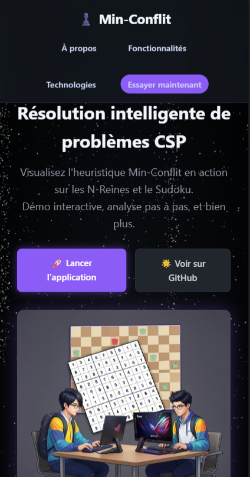
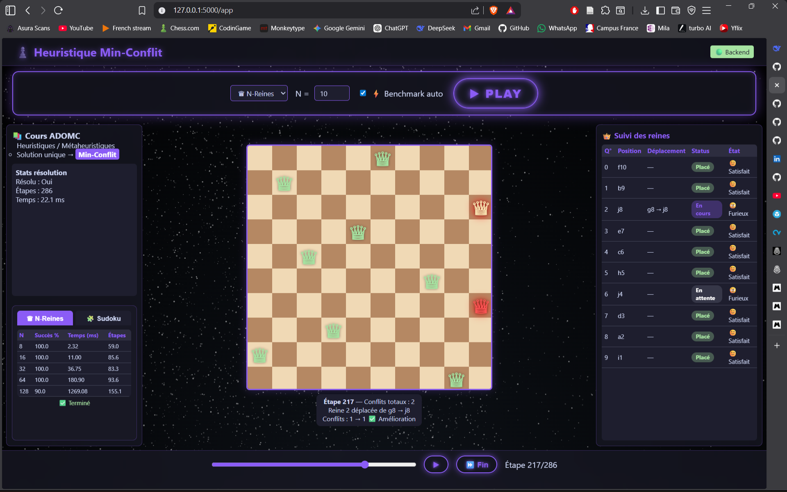
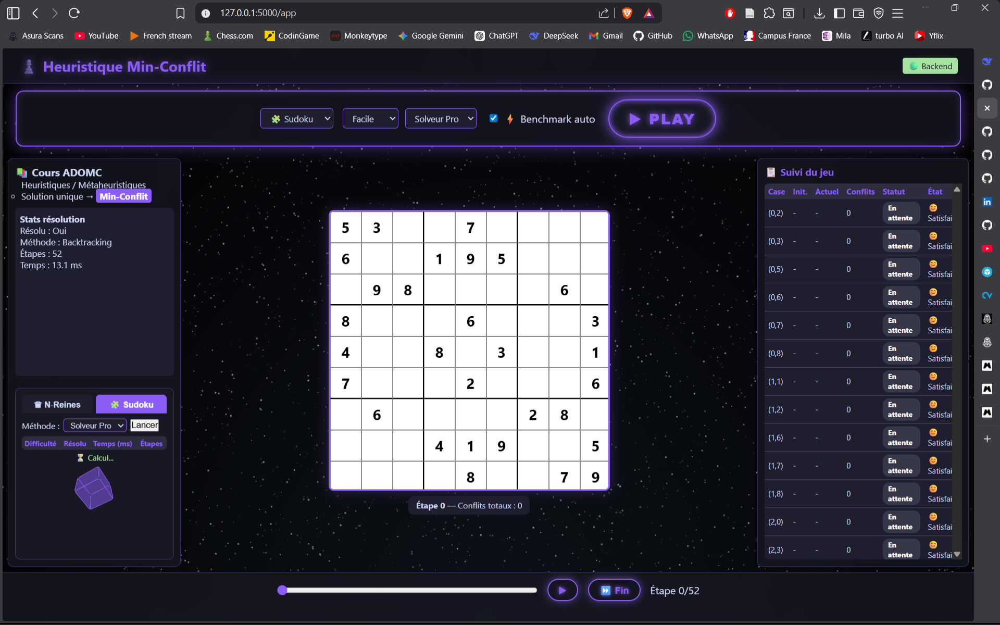

# Min-Conflit - Interactive CSP Solver

[](https://github.com/rfluciano/projet-min-conflit)
[](LICENSE)

A full-stack web application for visualizing constraint satisfaction problem solving with the Min-Conflict heuristic, with dedicated interfaces for N-Queens and Sudoku.

## Landing page

Start the server locally, open `http://127.0.0.1:5000/`, and use the landing page to jump into the interactive application.

<p align="center">
  
</p>

## Features

### N-Queens workspace

- Solve N-Queens with Min-Conflict
- Configure board size directly from the control panel
- Replay each move with the timeline slider, play/pause, and end shortcut
- Track conflicts, moved queens, benchmark results, and per-queen status in real time



### Sudoku workspace

- Choose `easy`, `medium`, `hard`, `expert`, or `custom`
- Run Sudoku with either `backtrack` or `minconf`
- Inspect the board, stats, benchmark panel, and cell tracking table step by step
- Enter a custom 9x9 grid from the interface when needed



### More highlights

- Automatic benchmark support for both N-Queens and Sudoku
- Backend status indicator in the application header
- Dark cyberpunk interface with local `particles.js` assets
- Responsive layout for desktop and mobile

## Tech stack

| Layer | Technology |
|-------|------------|
| Backend | Python, Flask |
| Solvers | Min-Conflict, Backtracking MRV |
| Frontend | Vanilla JavaScript, HTML, CSS |
| Visual effects | particles.js |

## Installation

```bash
git clone https://github.com/rfluciano/projet-min-conflit.git
cd projet-min-conflit
pip install flask
```

## Run the app

```bash
python app.py
```

Open:

- `http://127.0.0.1:5000/` for the landing page
- `http://127.0.0.1:5000/app` for the solver interface

## API routes

### Solve N-Queens

```bash
curl -X POST http://127.0.0.1:5000/solve -H "Content-Type: application/json" -d "{\"n\": 20, \"max_steps\": 500}"
```

### Solve Sudoku

```bash
curl -X POST http://127.0.0.1:5000/solve-sudoku -H "Content-Type: application/json" -d "{\"grid\": [[5,3,0,0,7,0,0,0,0],[6,0,0,1,9,5,0,0,0],[0,9,8,0,0,0,0,6,0],[8,0,0,0,6,0,0,0,3],[4,0,0,8,0,3,0,0,1],[7,0,0,0,2,0,0,0,6],[0,6,0,0,0,0,2,8,0],[0,0,0,4,1,9,0,0,5],[0,0,0,0,8,0,0,7,9]], \"method\": \"backtrack\"}"
```

### Run benchmarks

```bash
curl http://127.0.0.1:5000/benchmark
curl "http://127.0.0.1:5000/benchmark-sudoku?method=minconf"
```
